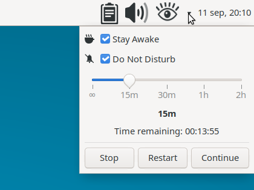

# xfce4-focus-plugin

Xfce panel plugin that gives you a single "Focus mode" you can start for a fixed duration, combining two optional effects:

- **Stay Awake** — temporarily inhibits screen locking, screen blanking (DPMS) and automatic suspend, the same idea as GNOME's *Caffeine*.
- **Do Not Disturb** — temporarily mutes notifications.

> **⚠ Early development.** This plugin is under active development, 
> has only been tested on a single machine/configuration (Ubuntu
> 26.04, Xfce 4.20), and hasn't had a stable release yet.

## The panel button

An eye icon: with lashes when Focus mode is active, and without lashes when it is inactive.. Click it to toggle the whole thing on or off using whatever is currently selected in the dropdown (see below). A small arrow next to it opens that dropdown without touching the running state.

## The dropdown

- **Stay Awake** / **Do Not Disturb** checkboxes. These only *select* what the next activation will include — checking or unchecking one has no immediate effect on your screen or notifications.
- A **duration scale** with 5 stops — Forever, 15m, 30m, 1h, 2h.
- A live **"Time remaining: hh:mm:ss"** countdown, shown only while Focus mode is active with a duration other than Forever.
- **Cancel/Stop** and **Start/Restart** buttons.

## Installation

- There is a [.deb package](https://github.com/rod-farias/xfce4-focus-plugin/releases) for Xfce 4.20 on Ubuntu 26.04; it is not guaranteed to install correctly on other combinations.
- For other distributions: clone the repository, install the dependencies, and build with make as detailed [here](/docs/DETAILS.md#building-and-installing).

Then right-click the panel → Panel → Add New Items… and add "Focus".

## Screenshots

- Plugin in inactive state

- Plugin in active state

- Dropdown preferences

## Known limitations

- Stay Awake has no effect on a session that runs neither a
  freedesktop/Xfce screensaver service nor xfce4-power-manager (e.g. a
  minimal Xfce install with both removed).
- The D-Bus inhibit and the duration countdown are only held for as
  long as the panel process is running.
- The eye icon artwork is a placeholder — good enough to tell the two
  states apart, but expected to be replaced with something better
  later.
